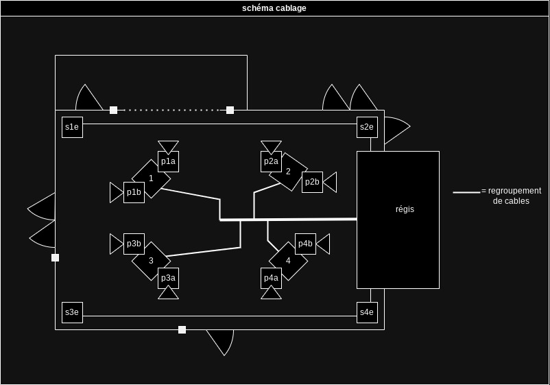
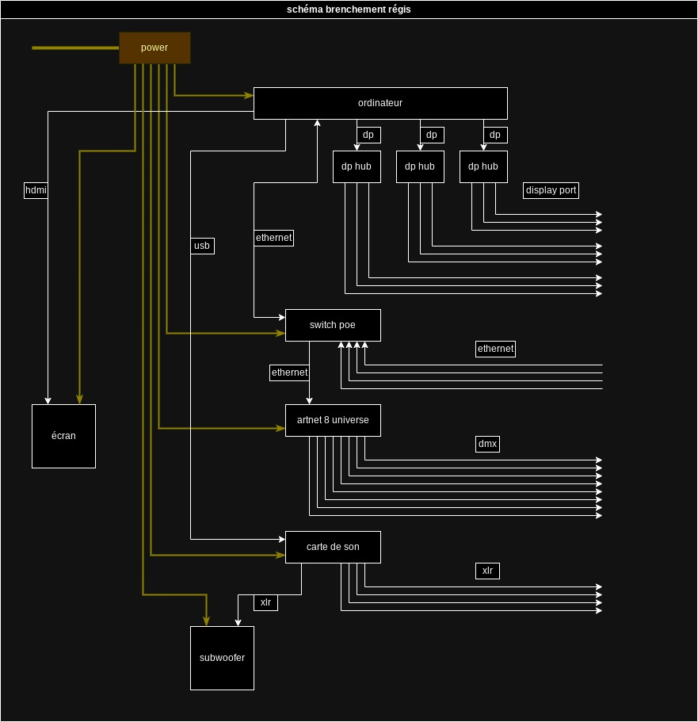
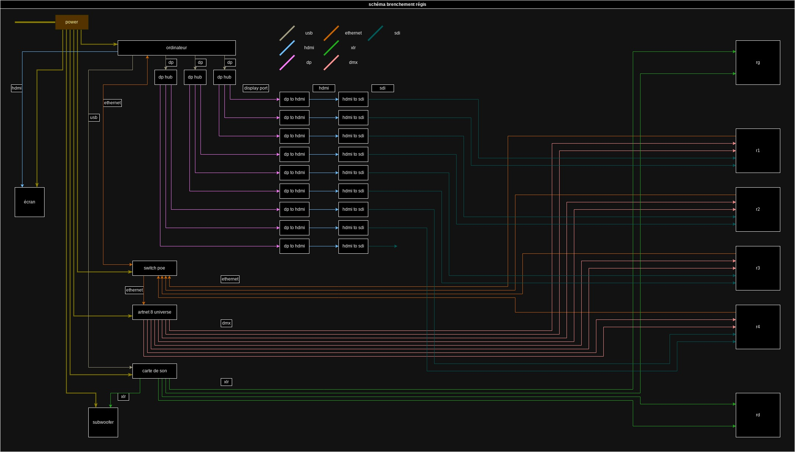
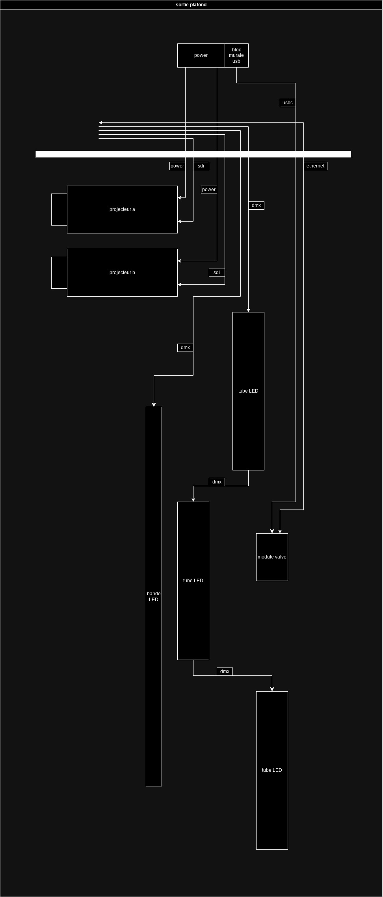
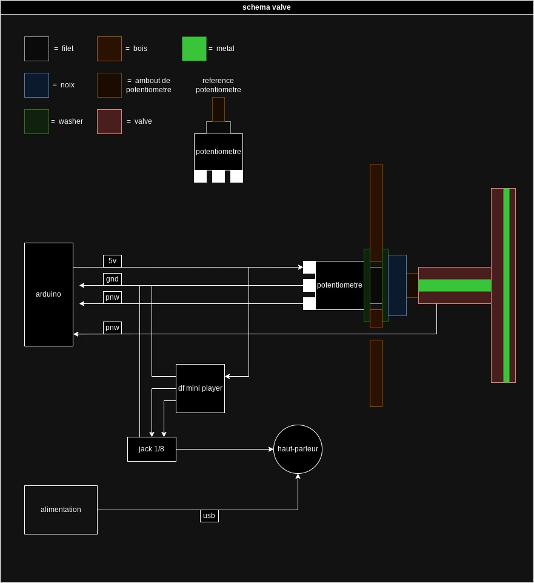

# Document de préproduction pour le Lumifest 2024

## Concept

### Intention de départ

Soulever l'Équilibre fragile entre les individus et leur environnement.

### Synopsis

L’expérience commence à l’extérieur de la salle lorsqu’un interacteur est attiré par le portail qui mène vers l’interieur de la pièce, un monde parallèle. En rentrant, l’interacteur découvre une pièce faiblement éclairé. Les projections sont vide de couleur, mais lorsque quelqu’un touche à un des capaciteurs (ou valves) l’oeuvre se “réveille” en mettant dans la projection ce qui est lié à sa tour.  Cette pièce devient donc un univers en constante évolution, mêlant formes abstraite, motifs, objets reconnaisables psychédélique. Des valves interactives (ou capaciteurs) invitent les utilisateurs à changer l’environnement pendant que quatre tours fusionnent de manière unique leur thèmes.

### But

#### Fusion des Esthétiques

Comprendre que l’environement va coexister malgré le chaos initial et que ça crée une identité nouvelle.

#### Participation Active

Permettre de comprendre l’impact de la personne sur son environnement.

#### Évasion et Réflexion

Faire sortir les gens de leur qutodien pour réfléchir à l’enjeu.

### Enjeu

L'œuvre soulève la question de l'équilibre délicat entre notre quête de progrès technologique et la préservation de notre connexion avec la nature. Les thèmes psychédéliques et cyberpunk se rejoignent pour illustrer un monde où ces deux éléments coexistent, mais pas toujours harmonieusement.

## Direction Artistique

### Description

1ère tour, Extrêmement Environnemental: illustre l’environnement autour de l'humain, pas seulement la nature, mais aussi la société

2ème tour, Culturellement Approprié: symbolise la diversité culturelle à travers des formes simples de type graffiti 

3ème tour, Proprement Neurologique:démontre l'Exploration de la conscience humaine et comment elle réagit par rapport à son environnement, Des liens interconnectés

4ème tour, Techniquement Technologique:MONTRE La technologie dans le monde ET SON OMNIPRÉSENCE

Style 2d et 3d mélangé

Univers de base en fractal

### Interactions

- Lorsqu’une la personne touche au capaciteur, un son sort du HP de la tour. 
- Lorsqu’une personne tourne la valve, le HP à l’intérieur de la tour fait un sortir un son

Exemples :​

https://youtu.be/0EZI1e_jhn0

### Bandes d'arrière-plan

#### Séquence d'ouverture

Ouverture et présentation du monde et des tours avec une animaation sonore mystérieuse et envoutante.

#### Bande sonore (Mode interactivité)

Bande sonore d'arrière plan durant le mode interactif qui fusionne les thèmes des différentes tours (environnemental, Culture, neurologique, technologique)

#### Climax

Crescendo de l'expérience sonore d'une durée de 1 minute. Cette trame rythmée et intense marque le somome de l'expérience.

## Direction Technique

### Description

L'oeuvre sera composé de quatre piliers sur lesquels nous attacherons des projecteurs (deux projecteurs par pilier) qui nous permettront de faire une projection 360. Les piliers seront également équiper de bandes LED décoratives et de valves de style industriel qui seront rattaché à des potentiomètre et des capteur de capacitance. Les données reçues depuis les capteurs seront ensuite acheminé vers la régis et elles impacteront la projection 360.

### Plantation Technique

Pour la projection 360, nous allons utiliser huit (8) projecteurs UST, fixés sur quatre (4) ponts d'éclairage d'une hauteur de huit (8) pieds chaques. Nous allons également faire passer l'ensemble des fils nécessaires au fonctionnement du projet en les attachants au plafond de la pièce.

- Nous avons numeroté chacun des piliers de un à quatre pour facilité l'utilisation multidimensionnel de l'espace. 
- Les projecteurs sont appelés par le numero du pilier sur lequel ils fixés précédé d'un "p", pour projecteur, et suivie d'un "a" ou un "b". Ces-dernières font référence au mur vers lequel le projecteur est dirigé. Les projecteurs se terminant avec la lettre "a" sont pointés vers les murs les plus longs, et les projecteurs se terminant par la lettre "b" sont pointés vers les murs les plus cours.
- Les hauts-parleurs suivent la même nomenclature. Soit la lettre "s", faisant référence au type de technologie, suivie d'un chiffre de un à quatre, faisant référence au quadrant de la pièce dans lequel le haut-parleur ce situe, et terminé par la lettre "e" ou la lettre "i". Ces-dernières font la différence entre les hauts-parleurs extérieur (e), qui si trouvent dans les quatre coins de la pièce, et les hauts-parleurs intérieur (i), qui se trouvent dans les piliers. 

### Brenchements

Pour les brenchements, nous allons centralisé la majorité de l'expérience sur la scène, que nous allons utilisé comme régis. Depuis cette régis, nous allons passé un (1) regroupement de fils de chaque côtés et quatre (4) depuis le milieu. 

#### régis

Le régie est l'endroit dans l'installation ou nous allons recevoir les données captées par le micro-controleur et nous allons les utilisé pour affecter l'ambiance sonore et les projections.  

Les fils se dirigeant de la régie à l'installation sont divisés en six (6) regroupement distinct. Ces-derniers suivent la même nomenclature que pour le reste du projet. Les regroupements de fils qui ne se dirigent pas vers des piliers sont numéroté par avec les lettres "d", pour le regroupement qui se dirige vers le côté droit de la pièce, et "g", pour le regroupement qui se dirige vers le côté gauche de la pièce. 

#### piliers

Bien que chacun des quatre (4) piliers sera different, les technologies utilisées seront sensiblement les mêmes. De facto, le branchement des technologies pour chacun des piliers sera le même. 

#### valve

Les valves sont l'élément intéractif principale de notre installation. Les valves seront connectées a un potentiomètre et relié à un resistor et un port PWN du micro-controleur. Pour s'éviter le trouble de trouver quatre (4) valve vintage pareil et d'avoir des soucis pour les fixés, nous avons décidé de les faire imprimé en 3D. 

### Liste de Matériel

Puisque nous avons besoin d'une quantitée diverse de matériel et pour faciliter la lecture, nous avons décidé de diviser la liste de matériel en plusieurs sections. Nous allons mettre entre parenthèse la quantité de chaque éléments que nous avons besoin.

#### matériel prêté par Lumifest.

Dans cette liste nous avons regroupé tout ce qui nous sera prêté par les organisateurs du Lumifest 2024.

- Ponts d'éclairage 8' (4)
- projecteurs UST 800px (8)
- convertisseur hdmi/sdi (8)
- cable sdi 100' (16)
- haut-parleurs (4)
- trepieds pour haut-parleur (4)
- cable xlr 100' (2)
- cable xlr 50' (4)
- artnet 8 univers (1) // à confirmer
- tube LED (9)
- bande LED (8)
- bande LED pixel (9)
- cable dmx 100' (4)
- cable dmx 50' (4)
- cable dmx 5' (12)
- u-ground 100' (4)
- u-ground 50' (4)
- power bar (5)
- poches de sable (24)

#### matériel du pmv que nous devons acheter

Dans cette liste, nous avons regroupé tout ce que nous devons acheter pour réaliser un produit minimum viable. Pour faciliter la compréhension, nous avons inséré des liens pour chacun des items.

- [ESP32-POE](https://www.digikey.ca/en/products/detail/olimex-ltd/ESP32-POE/10258717?utm_adgroup&utm_source=google&utm_medium=cpc&utm_campaign=PMax%20Product_Low%20ROAS%20Categories&utm_term&productid=10258717&utm_content&utm_id=go_cmp-20291741422_adg-_ad-__dev-c_ext-_prd-10258717_sig-Cj0KCQiA-62tBhDSARIsAO7twbbuaS895O0iKFZlhM52wHeb3qNiA9BaEHbKfJHeihLFH5BrcTVQeOgaAuObEALw_wcB&gad_source=1) (4)
- [df mini player](https://www.amazon.ca/Aideepen-DFPlay-Player-Support-Arduino/dp/B07BDD8BF3/ref=asc_df_B07BDD8BF3/?tag=googleshopc0c-20&linkCode=df0&hvadid=578872479514&hvpos=&hvnetw=g&hvrand=3997010125268453566&hvpone=&hvptwo=&hvqmt=&hvdev=c&hvdvcmdl=&hvlocint=&hvlocphy=9000398&hvtargid=pla-1649524406815&psc=1&mcid=ed33710875bc3ef0b0290923883cfbb7) (4)
- [1/8 jack module](https://www.digikey.ca/en/products/detail/cui-devices/MJ-3502/281321?utm_adgroup=&utm_source=google&utm_medium=cpc&utm_campaign=PMax%20Supplier_Focus%20Supplier&utm_term=&productid=281321&utm_content=&utm_id=go_cmp-20282403582_adg-_ad-__dev-c_ext-_prd-281321_sig-CjwKCAiAtt2tBhBDEiwALZuhACXGP7Aw6OxzMWvRmwUmgxPhtvm9qSbnXA1BMptA5-Tq7eCuLxQbdRoCezsQAvD_BwE&gad_source=1&gclid=CjwKCAiAtt2tBhBDEiwALZuhACXGP7Aw6OxzMWvRmwUmgxPhtvm9qSbnXA1BMptA5-Tq7eCuLxQbdRoCezsQAvD_BwE) (4)
- [haut-parleur intérieur](https://www.amazon.ca/Portable-Speaker-Interface-Smartphone-Computer/dp/B07RJR1XPH/ref=asc_df_B07RJR1XPH/?tag=googlemobshop-20&linkCode=df0&hvadid=341825615644&hvpos=&hvnetw=g&hvrand=17321004739133807997&hvpone=&hvptwo=&hvqmt=&hvdev=m&hvdvcmdl=&hvlocint=&hvlocphy=9000439&hvtargid=pla-813021010978&psc=1&mcid=c61e7c8226c937e390bba8e9cecc9571) (4)
- [carte sd](https://www.amazon.ca/Gigastone-Memory-Camcorder-Recorder-Playback/dp/B07SBL5GZB/ref=asc_df_B07SBL5GZB/?tag=googleshopc0c-20&linkCode=df0&hvadid=540626975969&hvpos=&hvnetw=g&hvrand=6668981857743626176&hvpone=&hvptwo=&hvqmt=&hvdev=c&hvdvcmdl=&hvlocint=&hvlocphy=9000398&hvtargid=pla-916421134773&mcid=5991f97f7ba734d090595c9e7cbb9338&th=1) (4)
- resistor (4)
- [potentiometre](https://www.amazon.ca/-/fr/BQLZR-3590S-2-103L-potentiom%C3%A8tres-rotatifs-pr%C3%A9cision/dp/B00RT8ZZWE/ref=sr_1_12?adgrpid=68757805817&hvadid=645778546304&hvdev=c&hvlocphy=9061031&hvnetw=g&hvqmt=e&hvrand=14365429445465706112&hvtargid=kwd-312004743830&hydadcr=7933_13615710&keywords=potentiom%C3%A8tre+multitour&qid=1707152372&sr=8-12) (4)
- valve (4) // impression 3d
- [clamp](https://www.amazon.ca/SmallRig-Thread-Monitor-Umbrellas-Shelves/dp/B075M3Y21G/ref=asc_df_B075M3Y21G/?tag=googleshopc0c-20&linkCode=df0&hvadid=335336194689&hvpos=&hvnetw=g&hvrand=14228036213940279672&hvpone=&hvptwo=&hvqmt=&hvdev=c&hvdvcmdl=&hvlocint=&hvlocphy=9000605&hvtargid=pla-794475055880&psc=1&mcid=51d30a1b61b838f6ae8a9a8f0b50d2c9) (15)
- [display port hub](https://www.amazon.ca/DisplayPort-Splitter-BolAAzuL-Adapter-Display/dp/B09L5YPM5D/ref=sr_1_27?keywords=displayport+hub&qid=1706217664&sr=8-27) (3)
- [cable display port](https://www.amazon.ca/DisplayPort-Benfei-Gold-Plated-Supports-Compatible/dp/B077BPW8XJ/ref=asc_df_B077BPW8XJ/?tag=googleshopc0c-20&linkCode=df0&hvadid=459346866217&hvpos=&hvnetw=g&hvrand=6240455701509316061&hvpone=&hvptwo=&hvqmt=&hvdev=c&hvdvcmdl=&hvlocint=&hvlocphy=9061031&hvtargid=pla-525295260888&psc=1&mcid=cfccc67ba31e3e2cbd1221cf241472ed) (3)
- [convertisseur display port/hdmi](https://www.amazon.ca/-/fr/adaptateur-DisplayPort-Uni-Directional-Converter-Compatible/dp/B07JFTK8YV/ref=sr_1_6?crid=1QHSQNG25UL8M&keywords=display+port+to+hdmi+cable&qid=1707150630&s=electronics&sprefix=displa%2Celectronics%2C231&sr=1-6) (9)
- [cable hdmi 1'](https://www.amazon.ca/valonic-Short-HDMI-Cable-ethernet/dp/B01JJPN9KY/ref=asc_df_B01JJPN9KY/?tag=googleshopc0c-20&linkCode=df0&hvadid=579383378528&hvpos=&hvnetw=g&hvrand=16043264866439293911&hvpone=&hvptwo=&hvqmt=&hvdev=c&hvdvcmdl=&hvlocint=&hvlocphy=9061031&hvtargid=pla-704048243718&psc=1&mcid=c8aea733e7313e4296168c5523c22d5d) (8)
- [carte de son](https://reverb.com/p/focusrite-scarlett-6i6-2nd-gen) (1)
- [subwoofer](https://www.amazon.com/PreSonus-Eris-Sub-8BT-Studio-Quality/dp/B0C891Q6YH/ref=sr_1_11?crid=1UXY9DPDH23R8&keywords=subwoofer&qid=1707065232&sprefix=subwoofe%2Caps%2C216&sr=8-11) (1)
- [cable ethernet 5'](https://www.amazon.ca/AmazonBasics-RJ45-Cat-6-Ethernet-Patch-Cable-5-Feet-1-5-Meters/dp/B00N2VILDM/ref=sr_1_5?dib=eyJ2IjoiMSJ9.l_p7A5Nn_42rbLEI0jzMDkHaqdaRO68SWKwjdMBt1Q0L6gCuKN9wuCnc7vQ6ZSxoGhHCNlFOOEQFbblY_M7AdwGzlk0lQ1Hhn04RK5MS9yJVcSM8O2eWAyA7HOO8_jk9dtksWgyLKArZmBC6BoHjev0WrdSjjdEe_udYy2v1Ff6nhPm18VMW0VJybFyDbOF_59k89OiKTGmxxTJ8vXOO_UieU0TgAzsDNQKp7kQjXR0GG2U-Ynr4B8NxsylbYJbxtPf8NtRc_c-s1iHt2WPy9z5qq8_Ul-FoySWH7hxYsC8.1P-fxsZNS1tsRaJgbjkw3pPi3KLPGkxDuYRV4psHDwo&dib_tag=se&hvadid=678253451499&hvdev=c&hvlocphy=1002604&hvnetw=g&hvqmt=e&hvrand=13077249694917579885&hvtargid=kwd-311231968976&hydadcr=4650_13351286&keywords=ethernet%2Bcable%2B5&qid=1708702217&sr=8-5&th=1) (2)
- [cable ethernet 100'](https://www.amazon.ca/PrimeCables-550MHz-Ethernet-Copper-Network/dp/B00H4O6IME/ref=sr_1_6?dib=eyJ2IjoiMSJ9.4nHMqkKVtAONMypB7PLsq1gx4XxUO9Em3vjkAUcYxcPIm0lGmhDpGv2FPsjEwsJz4EkmcxujYhh-BbiDEf7Fpojy_TiASmcpR0K25NUiKJqr2qLns5a_5qRiKHCDrQ0SpkNIYgDQ6bz3JzlP8ypOcTv5iJJBu06HcbyZ_WLUfu8whmTlmW2ocvfmQyLODKYU2FSYFFFuhi-yhzWjZKp4Wut-sP4ZT00HIxcTBvL9TcWvOxVUw9aUG_K-cLjFdO927iiyBDgpp0_ER6E5krjqPg8fTvxr3hBQ0V4bnsSObVM.Dj8oxNFxyMhM4yBCEFzKRxFHIHLx3UpvT9WD-tMVcH8&dib_tag=se&hvadid=678345879785&hvdev=c&hvlocphy=1002604&hvnetw=g&hvqmt=e&hvrand=17484013425276813697&hvtargid=kwd-374602467744&hydadcr=25140_13648527&keywords=ethernet+cable+100+foot&qid=1708703414&sr=8-6) (4)
- quincaillerie ()

#### matériel de déco que nous devons acheter

Dans cette liste, nous avons regroupé tout ce qui n'est pas essentiel pour le fonctionnement de l'installation, mais qui, jumelé à la projection 360 et à l'ambience sonore, crée un atmosphère plus immersif qui offre une expérience plus complète pour le publique.
Comme pour la dernière liste, nous avons intégrer des liens de référence pour chacun des éléments de la liste.

- [fausse plante (guirlande)](https://www.amazon.ca/-/fr/guirlandes-artificiel-artificielles-d%C3%A9coration-d%C3%A9v%C3%A9nement/dp/B0C7HH1TFQ?ref_=Oct_d_otopr_d_6647015011_1&pd_rd_w=LKoPy&content-id=amzn1.sym.a7e32360-e793-4626-8be6-0e726ac90cbb&pf_rd_p=a7e32360-e793-4626-8be6-0e726ac90cbb&pf_rd_r=E62ZKDQ9WJJ2Q7R9X1FS&pd_rd_wg=NkyT7&pd_rd_r=ad254d86-2cad-4dbc-87d1-d83c5733ad04&pd_rd_i=B0C7HH1TFQ&th=1) (1)
- [fausse plante (fougère)](https://www.amazon.ca/Huryfox-Artificial-Decoration-Farmhouse-Decorations/dp/B08DTWCWP9/ref=asc_df_B08DTWCWP9/?tag=googleshopc0c-20&linkCode=df0&hvadid=477595714032&hvpos=&hvnetw=g&hvrand=2867164183843164202&hvpone=&hvptwo=&hvqmt=&hvdev=c&hvdvcmdl=&hvlocint=&hvlocphy=9061031&hvtargid=pla-974565907571&psc=1&mcid=2a1301f9d9d4316d9780c7e93f5bbfa5) (1)
- [fausse plante (pothos)](https://www.amazon.ca/artificielles-suspendre-int%C3%A9rieur-ext%C3%A9rieur-d%C3%A9coration/dp/B09P51M2D1/ref=sxin_15_pa_sp_search_thematic_sspa?content-id=amzn1.sym.c1e6258b-eedc-4939-9630-a0b9df9f3f27%3Aamzn1.sym.c1e6258b-eedc-4939-9630-a0b9df9f3f27&cv_ct_cx=amazon+artificial+plants&hvadid=667066598313&hvdev=c&hvlocphy=9061031&hvnetw=g&hvqmt=e&hvrand=3153144384626716860&hvtargid=kwd-954378001889&hydadcr=29862_14759301&keywords=plantes+artificielles+amazon&pd_rd_i=B09P51M2D1&pd_rd_r=b5730a57-164d-42cf-85ae-8f337b00e33a&pd_rd_w=31yJc&pd_rd_wg=JdEqo&pf_rd_p=c1e6258b-eedc-4939-9630-a0b9df9f3f27&pf_rd_r=JC8KBYVK23JSBD80QMDS&qid=1707151439&sbo=RZvfv%2F%2FHxDF%2BO5021pAnSA%3D%3D&sr=1-1-acb80629-ce74-4cc5-9423-11e8801573fb-spons&sp_csd=d2lkZ2V0TmFtZT1zcF9zZWFyY2hfdGhlbWF0aWM&psc=1) (1)
- [plywood obs 1/2 4'x8'](https://www.homedepot.com/p/OSB-7-16-Application-as-4ft-X-8-ft-Sheathing-Panel-386081/202106230) (2)
- [grillage à lapin](https://www.amazon.ca/Hardware-Galvanized-Chicken-Protection-Supports/dp/B0C36KF3TS/ref=sr_1_3?keywords=grillage+pour+cloture&qid=1706837058&sr=8-3) (1)
- [ciment](https://www.homedepot.ca/product/quikrete-portland-cement-40kg/1000149591) (2)
- écran (1) // à trouver en temps et lieu, idéalement usagé
- engrenage (plusieurs) // 3d print?
- affiches (15) // à faire nous même
- tissu () // à discuter
- faux gazon ()

### Budget

Nous avons inclus dans le budget tout ce que nous allons devoir acheter pour réaliser notre projet. Pour faciliter la lecture, nous avons divisé le budget en deux tableaux. Le premier inclus tout ce qui est nécessaire au fonctionnement de l'oeuvre, et le deuxième inclus tout les élémnets de décor nécessaire à l'aspect esthétique de l'installation. ces tableaux seront suivie d'un prix total et d'un prix total auquel nous avont ajouté 15% de plus pour calculer les pertes.

#### Tableau 1

| produits | quantité | prix unitaire | prix total |
|----------|----------|---------------|------------|
| ESP32-POE | 4 | 26,99$ | 106,76$ |
| df mini player | 1 | 26,99$ | 26,99$ |
| 1/8 jack module | 6 | 1,95$ | 11,70$ |
| haut-parleur intérieur | 4 | 14,99$ | 59,96$ |
| carte sd | 1 | 39,98$ | 39,98$ |
| resistor | 4 | - | - |
| valves | 4 | - | - |
| pinces de fixations | 15 | 21,90$ | 328,50$ |
| display port hub | 3 | 56,99$ | 170,97$ |
| switch ethernet | 1 | 38,99$ | 38,99$ |
| carte de son | 1 | 153,01$ | 153,01$ |
| ordinateur | 1 | - | - |
| rig pour projecteur | 8 | 33,99$ | 271,92$ |
| cable ethernet (100') | 4 | 21,99$ | 87,96$ |
| cable ethernet (10') | 2 | - | - |
| display port to hdmi | 9 | 9,99$ | 89,91$ |
| hdmi (3') | 9 | 10,99$ | 98,91$ |
| fixture adressable | 8 | - | - |
| subwoofer | 1 | 199,99$ | 199,99$ |
| quincaillerie | - | - | - |

#### tableau 2

| produits | quantité | prix unitaire | prix total |
|----------|----------|---------------|------------|
| fausses plantes | 1 | 15,29$ | 15,29$ |
| plywood 1/2 4'x8' | 2 | 15,35$ | 30,70$ |
| grilage | 1 | 23,99$ | 23,99$ |
| écrans | - | - | - |
| faux gazon | - | - | - |
| ciment | 2 | 19,99$ | 39,98$ | 
| affiche | - | - | - |
| engrenage | - | - | - |
| tissue | - | - | - |
| tôle | 5 | 22,99$ | 114,95$ |

#### total

**total :** 2150,46$
**total + 15% :** 2795,60$
